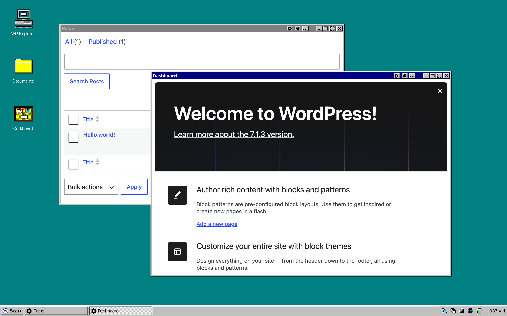

# Retro 95

A desktop theme for [OpenStation](https://github.com/WordPress/openstation) that turns WordPress into a mid-nineties desktop: grey bevels, navy title bars, a teal desk, and a taskbar with a Start menu.

**Try it live: https://wp-os-retro-95.space.fast**. WordPress runs in your browser, with nothing to install.



## Download

[Download Retro 95](https://github.com/mmtr/wp-os-retro-95/archive/refs/heads/main.zip) as a ZIP, or click **Code > Download ZIP** at the top of this page. The ZIP is the theme, ready to upload, with nothing to build.

Keep it zipped. If your browser unzips downloads (Safari does by default), compress the folder again before you upload it.

## Install

Needs an OpenStation version newer than 1.1.12.

1. In WordPress, open OpenStation and go to **Preferences > Themes**.
2. Drop the ZIP on the upload box, or click it and choose the ZIP.
3. Pick **Retro 95**, then click **Apply Retro 95's recommended layout and effects**. That switches the dock to the taskbar, puts the teal desk behind it, and clears Mio and the widgets off the desk.

## What's in it

- `theme.json`: the manifest, with the tokens, icons, textures, fonts, wallpaper and recommended settings.
- `chrome/`: bevels, title-bar buttons and their glyphs.
- `icons/`: the icon set.
- `fonts/`: OS Retro Sans, a bitmap face drawn for 11px.
- `src/`: the scripts that generate all of the above. The download ZIP leaves them out.

## Rebuild

Everything outside `src/` except `preview.svg` is generated. Edit the sources, then run the matching script from the repo root with Node 24:

```bash
node src/build-theme.mjs     # theme.json, from theme.mjs and icon-map.mjs
node src/build-chrome.mjs    # chrome/
node src/build-icons.mjs     # icons/, from icons.txt
node src/build-fonts.mjs     # fonts/, from retro-sans.txt and retro-sans-bold.txt
```

`src/icon-sheet.html` and `src/font-specimen.html` show the icons and the font at a glance.

## License

GPL-2.0-or-later, see `LICENSE.txt`. The fonts are under the SIL Open Font License 1.1, see `fonts/OFL.txt`.
